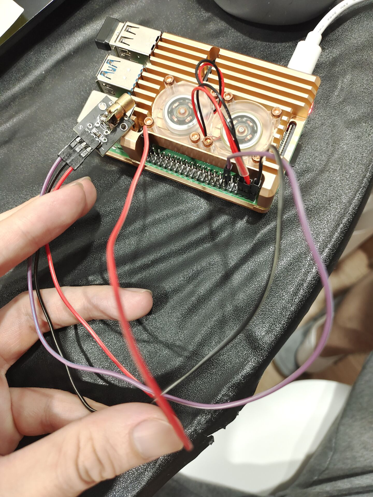
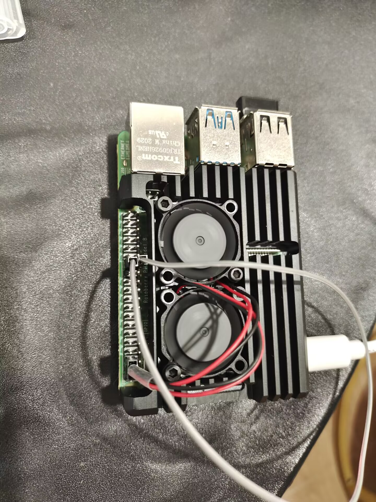
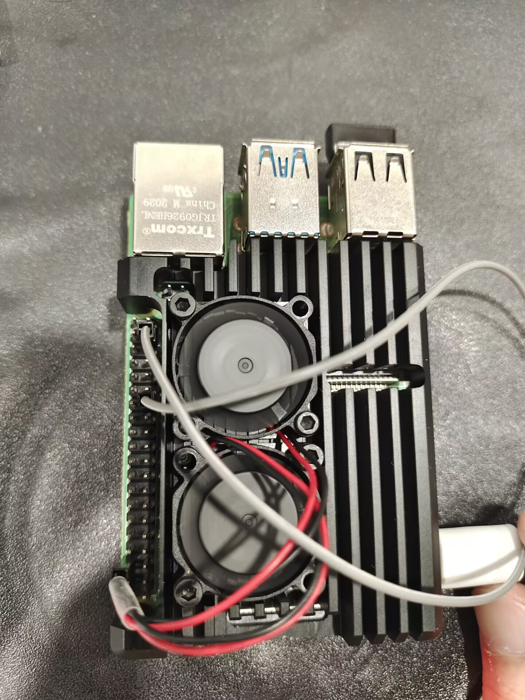
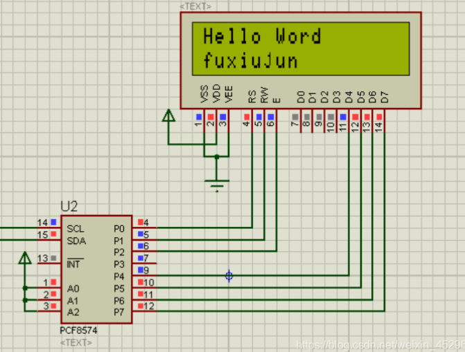
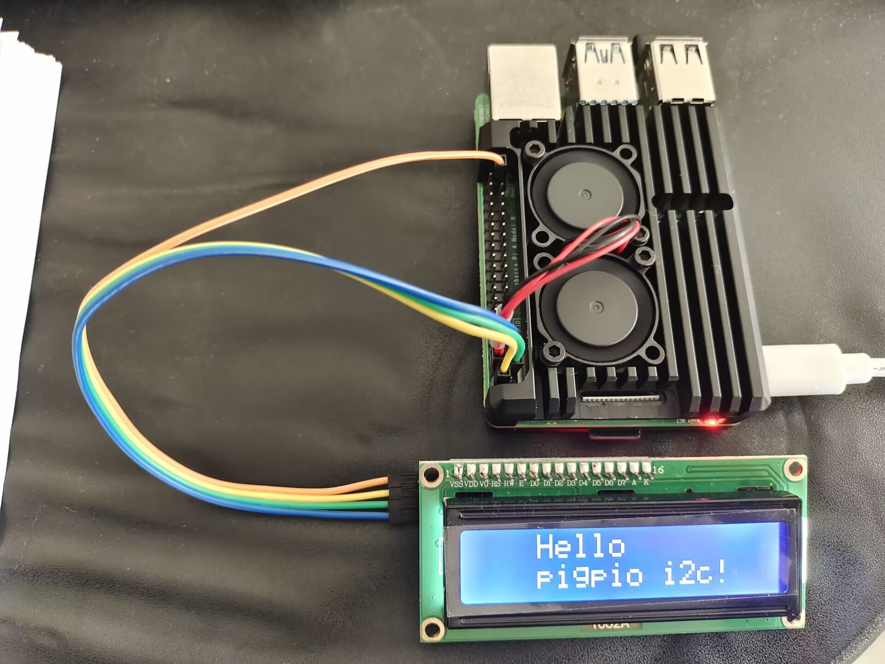
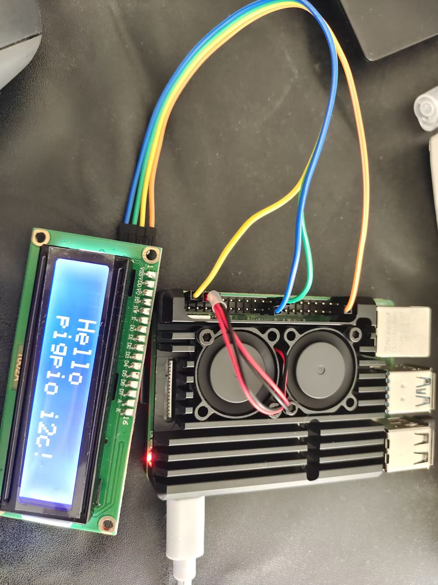

# pigpio 使用

关于树莓派的GPIO使用，网上有大量资料都过于老旧。

pigpio是一个较为新的树莓派gpio控制库，但是这个库的使用资料都比较简单，几乎都是一手资料。因此我想再此做一个基础系统的pigpio库的使用方法。

文档主要以python语言为主做pigpio的介绍媒介。

## pigpio的特性

- hardware timed sampling and time-stamping of GPIO 0-31 every 5 us
- hardware timed PWM on all of GPIO 0-31
- hardware timed servo pulses on all of GPIO 0-31
- callbacks on GPIO 0-31 level change (time accurate to a few us)
- notifications via pipe on GPIO 0-31 level change
- callbacks at timed intervals
- reading/writing all of the GPIO in a bank (0-31, 32-53) as a single operation
- GPIO reading, writing, modes, and internal pulls
- socket and pipe interfaces for the bulk of the functionality
- waveforms to generate GPIO level changes (time accurate to a few us)
- software serial links using any user GPIO
- rudimentary permission control through the socket and pipe interfaces
- creating and running scripts on the pigpio daemon
- 支持远程访问，默认端口 8888

## pigpio的安装

采用源码安装（命令行安装的方式自行百度）

```
git clone https://github.com/joan2937/pigpio.git -b v79 #我做整理的时候最新版本是这个，后续有新的建议用最新的
cd pigpio
make
sudo make install
# test
sudo x_pigpio
sudo pigpiod #启动pigpio后台服务，否则后续的测试会失败
./x_pigpio.py
./x_pigs
./x_pipe
```

使用pigpio的时候，需要保证后台进程pigpiod是在运行的。

```
sudo systemctl enable pigpiod
```

## 指导文档

本文把[官方指导文档](http://abyz.me.uk/rpi/pigpio/index.html)作为主体，一步步深入学习pigpio的使用方法。

## 点亮LED（控制GPIO输出高低电平）

点亮led就和，hello world一样重要和基础。所以我们的学习由点亮LED灯开始。

由于是第一次使用我会详细介绍每一行，

```
pi@raspberrypi:~/gpio/pigpio-79 $ python
Python 3.9.2 (default, Feb 28 2021, 17:03:44)
[GCC 10.2.1 20210110] on linux
Type "help", "copyright", "credits" or "license" for more information.
>>> import pigpio #导入 pigpio 模块
>>> pi = pigpio.pi() #启动客户端链接pigpiod 我这里使用的默认参数，也可以指定pigpio.pi("hostname", port)
>>> pi.connected #判断客户端链接是否成功
True
>>> led_ctl = 17 #设置led的控制管脚为 gpio17 也就是排针的11阵脚，并且由于我手上没有led灯，我是用的是激光。控制原理一样的
>>> pi.set_mode(led_ctl, pigpio.OUTPUT)#设置led_ctl为输出属性
0
>>> pi.write(led_ctl, 1)#高电平输出
0
>>> pi.write(led_ctl, 0)#低电平输出
0
>>> pi.stop()
>>> exit()
```



激光头侧，**红色为底线，黑色为正极**，紫色为控制线。

## 读取按键输入（读取GPIO的电平状态）

这里因为没有复位按键可以直接采用管脚接地和接高电平测试。

```
pi@raspberrypi:~/gpio/pigpio-79 $ python
Python 3.9.2 (default, Feb 28 2021, 17:03:44)
[GCC 10.2.1 20210110] on linux
Type "help", "copyright", "credits" or "license" for more information.
>>> import pigpio
>>> pi = pigpio.pi()
>>> pi.connected
True
>>> bt_ctl = 17 #依然是gpio17
>>> pi.set_mode(bt_ctl, pigpio.INPUT) #设置属性为输入
0
>>> pi.set_pull_up_down(bt_ctl, pigpio.PUD_DOWN) #设置拉低属性（也是默认的属性）也可以设置拉高
0
>>> pi.read(bt_ctl)
0
>>> pi.read(bt_ctl)
1
>>> pi.read(bt_ctl)
0
>>> pi.read(bt_ctl)
1
>>> pi.stop()
>>> exit()
```

## 串口通信

pigpio支持硬件串口通信，需要提前打开树莓派的串口。打开方式参见[树莓派串口](https://github.com/jinfeihan57/raspberrypiBJ/tree/main/%E6%A0%91%E8%8E%93%E6%B4%BE%E4%B8%B2%E5%8F%A3)。pigpio实现了硬件的串口通信，但是硬件的串口通信是有数量（在树莓派4B之前的版本，树莓派3和3+上都是稀缺资源）的并且要求使用指定的 io 口。因此pigpio同时实现了软件串口（bb_serial_read_open）通信的读，**仅支持读**。推荐使用硬件的串口，支持更多的设置，可判断待读信息的大小。

串口2自通信接线图



```
pi@raspberrypi:~ $ python
Python 3.9.2 (default, Feb 28 2021, 17:03:44)
[GCC 10.2.1 20210110] on linux
Type "help", "copyright", "credits" or "license" for more information.
>>> import pigpio
>>> pi = pigpio.pi()
>>> pi.connected
True
>>> u2 = pi.serial_open("/dev/ttyAMA1", 19200)
>>> pi.serial_write(u2, b"hello u2")
0
>>> (c, d) = pi.serial_read(u2, 100)
>>> print(c)
8
>>> print(d)
bytearray(b'hello u2')
>>> pi.serial_write(u2, "hello u2")
0
>>> (c, d) = pi.serial_read(u2, 100)
>>> print(c)
8
>>> print(d)
bytearray(b'hello u2')
>>> pi.serial_write(u2, "hello u2")
0
>>> pi.serial_data_available(u2)
8
>>> (c, d) = pi.serial_read(u2, 8)
>>> print(d)
bytearray(b'hello u2')
>>> pi.serial_write_byte(u2, 96)
0
>>> pi.serial_data_available(u2)
1
>>> (c, d) = pi.serial_read(u2, 1)
>>> print(c)
1
>>> print(d)
bytearray(b'`')
>>> pi.serial_close(u2)
0
>>> pi.stop()
>>> exit()
pi@raspberrypi:~ $
```

采用模拟串口接收功能实现任意gpio的串口读功能，读出的结果被存放在一个环形缓存中（具体缓存大小待测）。

串口2发送信息，gpio26接受信息接线图



```
pi@raspberrypi:~ $ python
Python 3.9.2 (default, Feb 28 2021, 17:03:44)
[GCC 10.2.1 20210110] on linux
Type "help", "copyright", "credits" or "license" for more information.
>>> import pigpio
>>> pi = pigpio.pi()
>>> pi.connected
True
>>> u2 = pi.serial_open("/dev/ttyAMA1", 19200)
>>> rxio = 26
>>> pi.bb_serial_read_open(rxio, 19200)
0
>>> pi.serial_write(u2, b'hello gpio26')
0
>>> (c, d) = pi.bb_serial_read(rxio)
>>> print(c)
12
>>> print(d)
bytearray(b'hello gpio26')
>>> pi.serial_write_byte(u2, 0)
0
>>> (c, d) = pi.bb_serial_read(rxio)
>>> print(c)
1
>>> print(d)
bytearray(b'\x00')
>>> pi.stop()
>>> exit()
pi@raspberrypi:~ $
```

## I2C通信

想要i2c通信首先要打开树莓派的i2c通信。

```
sudo raspi-config
-->3 Interface Options    Configure connections to peripherals
   -->I5 I2C           Enable/disable automatic loading of I2C kernel module
      -->YES
```

开启后无需重启即可在/dev 目录下多出一个i2c设备总线1，这里默认打开的是i2c总线1(其他总线的开启方式参见[串口的开启方式](https://github.com/jinfeihan57/raspberrypiBJ/tree/main/%E6%A0%91%E8%8E%93%E6%B4%BE%E4%B8%B2%E5%8F%A3#raspberrypi-4b-%E4%B8%B2%E5%8F%A3%E4%BD%BF%E7%94%A8))。设备20和21都是系统使用的i2c总线，不是我们开启的。


查看i2c,总线上挂载的设备，每个设备都在总线上有一个地址。0x00-0xFF，0x00不能使用所以最多挂载127个设备。

```
pi@raspberrypi:~ $ sudo apt-get install -y i2c-tools #安装i2c工具
Reading package lists... Done
Building dependency tree... Done
Reading state information... Done
i2c-tools is already the newest version (4.2-1+b1).
i2c-tools set to manually installed.
The following package was automatically installed and is no longer required:
  libfuse2
Use 'sudo apt autoremove' to remove it.
0 upgraded, 0 newly installed, 0 to remove and 15 not upgraded.
pi@raspberrypi:~ $ sudo i2cdetect -y 20 # 查看i2c 20总线上的设备
     0  1  2  3  4  5  6  7  8  9  a  b  c  d  e  f
00:                         08 09 0a 0b 0c 0d 0e 0f
10: 10 11 12 13 14 15 16 17 18 19 1a 1b 1c 1d 1e 1f
20: 20 21 22 23 24 25 26 27 28 29 2a 2b 2c 2d 2e 2f
30: -- -- -- -- -- -- -- -- 38 39 3a 3b 3c 3d 3e 3f
40: 40 41 42 43 44 45 46 47 48 49 4a 4b 4c 4d 4e 4f
50: -- -- -- -- -- -- -- -- -- -- -- -- -- -- -- --
60: 60 61 62 63 64 65 66 67 68 69 6a 6b 6c 6d 6e 6f
70: 70 71 72 73 74 75 76 77
pi@raspberrypi:~ $ sudo i2cdetect -y 21
     0  1  2  3  4  5  6  7  8  9  a  b  c  d  e  f
00:                         08 09 0a 0b 0c 0d 0e 0f
10: 10 11 12 13 14 15 16 17 18 19 1a 1b 1c 1d 1e 1f
20: 20 21 22 23 24 25 26 27 28 29 2a 2b 2c 2d 2e 2f
30: -- -- -- -- -- -- -- -- 38 39 3a 3b 3c 3d 3e 3f
40: 40 41 42 43 44 45 46 47 48 49 4a 4b 4c 4d 4e 4f
50: -- -- -- -- -- -- -- -- -- -- -- -- -- -- -- --
60: 60 61 62 63 64 65 66 67 68 69 6a 6b 6c 6d 6e 6f
70: 70 71 72 73 74 75 76 77
pi@raspberrypi:~ $ sudo i2cdetect -y 1 # 查看我们打开的i2c 1总线上的设备，因为我还没有接线因此没有设备
     0  1  2  3  4  5  6  7  8  9  a  b  c  d  e  f
00:                         -- -- -- -- -- -- -- --
10: -- -- -- -- -- -- -- -- -- -- -- -- -- -- -- --
20: -- -- -- -- -- -- -- -- -- -- -- -- -- -- -- --
30: -- -- -- -- -- -- -- -- -- -- -- -- -- -- -- --
40: -- -- -- -- -- -- -- -- -- -- -- -- -- -- -- --
50: -- -- -- -- -- -- -- -- -- -- -- -- -- -- -- --
60: -- -- -- -- -- -- -- -- -- -- -- -- -- -- -- --
70: -- -- -- -- -- -- -- --
```

我手头只有个一i2c通信的1602液晶屏，因此我用这个做实例。将屏幕四根线接入树莓派，电源底线对应接好，然后是

SDA接GPIO2，SCL接GPIO3.  i2c总线1可以发现设备 0x27（1602液晶屏的默认地址），说明接线没有问题。

```
pi@raspberrypi:~  $ sudo i2cdetect -y 1
     0  1  2  3  4  5  6  7  8  9  a  b  c  d  e  f
00:                         -- -- -- -- -- -- -- --
10: -- -- -- -- -- -- -- -- -- -- -- -- -- -- -- --
20: -- -- -- -- -- -- -- 27 -- -- -- -- -- -- -- --
30: -- -- -- -- -- -- -- -- -- -- -- -- -- -- -- --
40: -- -- -- -- -- -- -- -- -- -- -- -- -- -- -- --
50: -- -- -- -- -- -- -- -- -- -- -- -- -- -- -- --
60: -- -- -- -- -- -- -- -- -- -- -- -- -- -- -- --
70: -- -- -- -- -- -- -- --
```

官网的i2c，有很多的api。但是我手上的i2c 1602液晶屏没法都验证。只能验证基本的接口即i2c写接口。其他接口使用方法差异不大。

[具体代码详见](https://github.com/jinfeihan57/raspberrypiBJ/blob/main/%E6%A0%91%E8%8E%93%E6%B4%BEIIC/IIC1602.py)

i2c1602 接线图



i2c1602与树莓派接线图



### 其他i2c总线的使用

开启i2c总线4（总线3与总线1默认io口一样），在/boot/config.txt 文件末尾加

```
dtoverlay=i2c4
```

然后重启，查看i2c bus4


查看i2c总线4的io管脚和已连接的设备

```
pi@raspberrypi:~ $ dtoverlay -h i2c4
Name:   i2c4

Info:   Enable the i2c4 bus. BCM2711 only.

Usage:  dtoverlay=i2c4,<param>

Params: pins_6_7                Use GPIOs 6 and 7
        pins_8_9                Use GPIOs 8 and 9 (default) #默认io 8SDA 9SCL
        baudrate                Set the baudrate for the interface (default
                                "100000")

pi@raspberrypi:~ $ sudo i2cdetect -y 4 #接线后
     0  1  2  3  4  5  6  7  8  9  a  b  c  d  e  f
00:                         -- -- -- -- -- -- -- --
10: -- -- -- -- -- -- -- -- -- -- -- -- -- -- -- --
20: -- -- -- -- -- -- -- 27 -- -- -- -- -- -- -- -- #液晶屏幕已经接入 i2c 总线4
30: -- -- -- -- -- -- -- -- -- -- -- -- -- -- -- --
40: -- -- -- -- -- -- -- -- -- -- -- -- -- -- -- --
50: -- -- -- -- -- -- -- -- -- -- -- -- -- -- -- --
60: -- -- -- -- -- -- -- -- -- -- -- -- -- -- -- --
70: -- -- -- -- -- -- -- --
pi@raspberrypi:~ $
```

注释[代码](https://github.com/jinfeihan57/raspberrypiBJ/blob/main/%E6%A0%91%E8%8E%93%E6%B4%BEIIC/IIC1602.py)中的116行，释放117行


