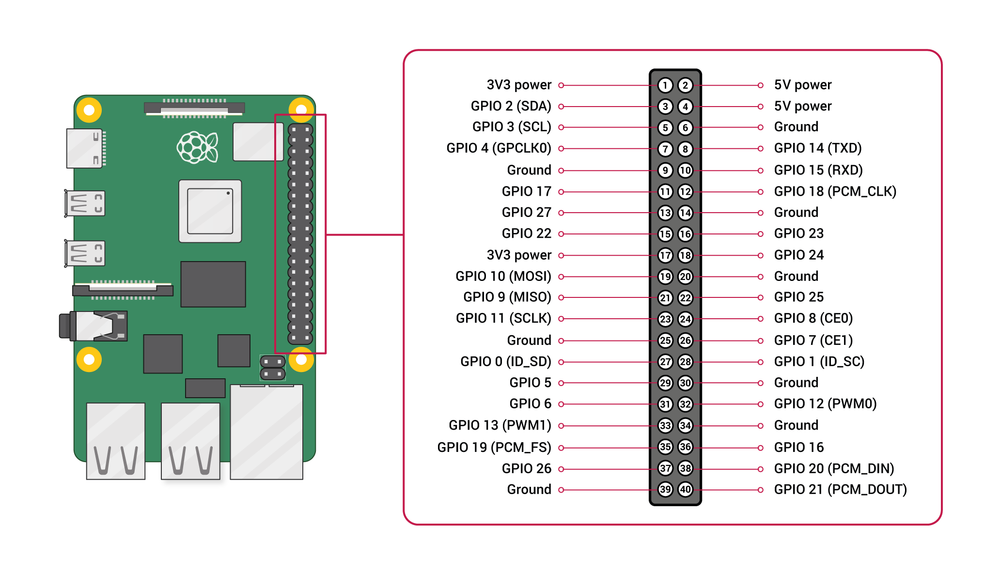

# RaspberryPi 4B 串口使用

相比树莓派零、1、2 以及 3 的双串口 UART0（PL011）和 UART1（mini UART），树莓派4 中新增了 4 个 PL011 串口共计有 6 个 UART，整理此笔记用作记录和配置参考。

## 查看树莓派4B串口

```
pi@raspberrypi:~ $ dtoverlay -a | grep uart
  midi-uart0
  midi-uart1
  midi-uart2
  midi-uart3
  midi-uart4
  midi-uart5
  miniuart-bt
  qca7000-uart0
  uart0
  uart1
  uart2
  uart3
  uart4
  uart5
```

uart0-uart5六个串口。

## 查看各个串口的GPIO

串口通信由4根信号线，tx, rx, cts, rts。cts和rts一般被禁用。因此我们通常的用法是只使用tx和rx。由下面的输出结果也可以看出，每个串口占用4个GPIO，其中cts和rts都是off状态。

```
pi@raspberrypi:~ $ dtoverlay -h uart0
Name:   uart0
Info:   Change the pin usage of uart0
Usage:  dtoverlay=uart0,<param>=<val>
Params: txd0_pin                GPIO pin for TXD0 (14, 32 or 36 - default 14)
        rxd0_pin                GPIO pin for RXD0 (15, 33 or 37 - default 15)
        pin_func                Alternative pin function - 4(Alt0) for 14&15,
                                7(Alt3) for 32&33, 6(Alt2) for 36&37
pi@raspberrypi:~ $ dtoverlay -h uart1
Name:   uart1
Info:   Change the pin usage of uart1
Usage:  dtoverlay=uart1,<param>=<val>
Params: txd1_pin                GPIO pin for TXD1 (14, 32 or 40 - default 14)
        rxd1_pin                GPIO pin for RXD1 (15, 33 or 41 - default 15)
pi@raspberrypi:~ $ dtoverlay -h uart2
Name:   uart2
Info:   Enable uart 2 on GPIOs 0-3. BCM2711 only.
Usage:  dtoverlay=uart2,<param>
Params: ctsrts                  Enable CTS/RTS on GPIOs 2-3 (default off)
pi@raspberrypi:~ $ dtoverlay -h uart3
Name:   uart3
Info:   Enable uart 3 on GPIOs 4-7. BCM2711 only.
Usage:  dtoverlay=uart3,<param>
Params: ctsrts                  Enable CTS/RTS on GPIOs 6-7 (default off)
pi@raspberrypi:~ $ dtoverlay -h uart4
Name:   uart4
Info:   Enable uart 4 on GPIOs 8-11. BCM2711 only.
Usage:  dtoverlay=uart4,<param>
Params: ctsrts                  Enable CTS/RTS on GPIOs 10-11 (default off)
pi@raspberrypi:~ $ dtoverlay -h uart5
Name:   uart5
Info:   Enable uart 5 on GPIOs 12-15. BCM2711 only.
Usage:  dtoverlay=uart5,<param>
Params: ctsrts                  Enable CTS/RTS on GPIOs 14-15 (default off)
pi@raspberrypi:~ $
```

## 开启树莓派串口功能

#### 方法1：

```
sudo raspi-config
```


根据导引设置好后重启树莓派。

#### 方法2：

修改/boot/config.txt文件已达到使能树莓派目的。

```
sudo vim /boot/config.txt
```

在文件末尾加上

```
[all]
enable_uart=1
```

保存退出，重启树莓派。

## 开启树莓派4B的串口IO

查看串口设备信息

```
pi@raspberrypi:~ $ ls -al /dev/ttyAMA*
crw-rw---- 1 root dialout 204, 64 Sep 25 13:17 /dev/ttyAMA0
```

在查看串口的IO步骤时，已经获取了，各个串口的管脚信息，根据自己的IO管脚使用情况开启需要的uart。

```
sudo vim /boot/config.txt
```

在文末加入

```
dtoverlay=uart2
```

我这里开启了uart2，对应GPIO0和GPIO1.并且不使用CTS/RTS模式。

重启树莓派,查看串口设备

```
pi@raspberrypi:~ $ ls -al /dev/ttyAMA*
crw-rw---- 1 root dialout 204, 64 Sep 25 13:17 /dev/ttyAMA0
crw-rw---- 1 root dialout 204, 65 Sep 25 14:43 /dev/ttyAMA1 #多出的即为我们设置打开的uart2
```

## 接线

查看uart2管脚对应的排针接口

使用命令查看引脚

```
pi@raspberrypi:~/gpio $ pinout
,--------------------------------.
| oooooooooooooooooooo J8   +======
| 1ooooooooooooooooooo  PoE |   Net
|  Wi                    1o +======
|  Fi  Pi Model 4B  V1.4 oo      |
|        ,----. +---+         +====
| |D|    |SoC | |RAM|         |USB3
| |S|    |    | |   |         +====
| |I|    `----' +---+            |
|                   |C|       +====
|                   |S|       |USB2
| pwr   |hd|   |hd| |I||A|    +====
`-| |---|m0|---|m1|----|V|-------'

Revision           : d03114
SoC                : BCM2711
RAM                : 8GB
Storage            : MicroSD
USB ports          : 4 (of which 2 USB3)
Ethernet ports     : 1 (1000Mbps max. speed)
Wi-fi              : True
Bluetooth          : True
Camera ports (CSI) : 1
Display ports (DSI): 1

J8:
   3V3  (1) (2)  5V
 GPIO2  (3) (4)  5V
 GPIO3  (5) (6)  GND
 GPIO4  (7) (8)  GPIO14
   GND  (9) (10) GPIO15
GPIO17 (11) (12) GPIO18
GPIO27 (13) (14) GND
GPIO22 (15) (16) GPIO23
   3V3 (17) (18) GPIO24
GPIO10 (19) (20) GND
 GPIO9 (21) (22) GPIO25
GPIO11 (23) (24) GPIO8
   GND (25) (26) GPIO7
 GPIO0 (27) (28) GPIO1
 GPIO5 (29) (30) GND
 GPIO6 (31) (32) GPIO12
GPIO13 (33) (34) GND
GPIO19 (35) (36) GPIO16
GPIO26 (37) (38) GPIO20
   GND (39) (40) GPIO21

POE:
TR01 (1) (2) TR00
TR03 (3) (4) TR02

For further information, please refer to https://pinout.xyz/
pi@raspberrypi:~/gpio $
```

官网信息查看引脚



根据上图将排针27，28针脚短接。（自发自收测试）

## 串口发送 “hello raspberrypi”

测试代码如下

pi@raspberrypi:~ $ python
Python 3.9.2 (default, Feb 28 2021, 17:03:44)
[GCC 10.2.1 20210110] on linux
Type "help", "copyright", "credits" or "license" for more information.

import serial #导入串口模块
uart2 = serial.Serial(port="/dev/ttyAMA1", baudrate=9600)#设置串口和波特率
uart2.write("hellow raspberrypi".encode("utf8"))#写入内容主要要encode
18
uart2.read(18)#写入18，读取18
b'hellow raspberrypi'
uart2.write("hellow raspberrypi\n".encode("utf8"))
19
uart2.readline()#写入带换行符，读取一行
b'hellow raspberrypi\n'
uart2.write("hellow raspberrypi\n".encode("utf8"))
19
uart2.read(10)#当不知道写入多少时，读取将会是非常困难的事，因此推荐以换行符为消息的界限。或者自定义一个协议来读取串口数据
b'hellow ras'
uart2.read(9)
b'pberrypi\n'

可以同时开两个终端，两个终端的串口设置保持一致。就可以两个终端互相收发消息。注意读是阻塞的（如果读取的数量小于写入的数量则阻塞一直等到足够的数量读函数才返回）。
