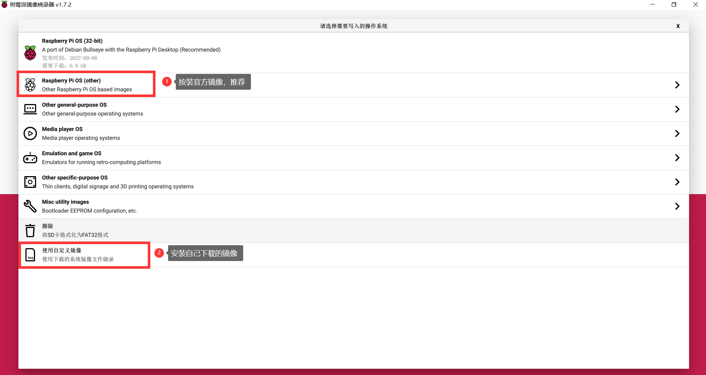

# RaspberryPi 初识

## 安装官方树莓派镜像烧录器

登录[官网](https://www.raspberrypi.com/software/)下载烧录器


双击安装包，安装镜像烧录器。

## 烧录镜像

### 打开镜像烧录器


### 烧录器界面


这里注意4暂时为空当你选择好1,2后，才会出现4. 

### 镜像选择



1. 使用官方镜像，点击进入选择自己适配的镜像即可。（新手建议）树莓派3，3B，4 使用64位带桌面的镜像。树莓派自带HDMI接口3和3B使用的标准HDMI，树莓派4使用的是两个micro HDMI，建议优先使用靠近电源接口的。安装带镜像的桌面是因为在有显示器的时候，可以像使用电脑那样使用树莓派。卡片电脑名不虚传。即便现在没有hdmi显示器也推荐新手安装带桌面镜像。万一以后有呢。（对于老手）大家随意玩。
2. 按装自己的镜像：
   - 使用官方镜像是需要联网下载镜像的，这个比较慢。用户可以自行[下载树莓派官方的镜像](https://www.raspberrypi.com/software/operating-systems/)（注意一定下载自己版本对应的系统）。下载后，烧录时选择使用自定义的镜像即可。
   - 自己不备份的镜像或者从老手哪里获得的镜像，这类镜像一般比较大（只是看上去大，因为树莓派系统备份，一般都是整个SD卡备份，SD卡多大镜像就多大，因此准备做镜像给别人用的话，最好不要用太大的SD卡，以免用户SD卡太小没法使用）。

### SD卡选择

点击选则自己的SD卡即可

### 烧录配置


选择好系统和SD卡后点击右下角出现的齿轮，然后全屏（方便查看设置）。

#### **!!! 高级设置 !!!**


这里没啥好说的，如果你使用的是网线直连路由器可以不设置wifi。

### 烧录

全部设置好后，点击烧录即可。这里根据你SD卡的写入效率时间不等。树莓派4建议用好点的SD卡，不要让SD卡成为性能瓶颈，还有就是散热，不要塑料壳的，优选金属外壳加风扇。

点击后等待烧录完成即可。

### 第一次上电

烧录完成的SD卡取出后插入树莓派上电（这里注意树莓派直插入了一根电源线）。因为是第一次上电需要3-5分钟等待系统启动（因为没有使用屏幕只能干等）等待绿灯不在频繁闪烁即可，期间红灯不能闪烁，红灯是电源指示灯，红灯闪烁或者灭代表电源功率不够，换 更大功率电源和更粗的电源线（手机快充的充电器即可）。

### 获取树莓派IP地址

3-5分钟后启动接入同一网络的windows电脑的命令行

```
#输入
ping -4 raspberrypi.local
# raspberrypi.local 为高级设置里的第一项
```


上图可以ping通获取IP，即表明，树莓派已经接入wifi（高级设置中的wifi成功）。

### SSH链接树莓派

打开ssh链接工具，我这里推荐使用[mobaxterm](https://mobaxterm.mobatek.net/download.html)，点击左上角的Session


弹出的对话框，按下图顺序操作填写


点击OK,弹出的对话框中输入你的树莓派密码（高级设置里的2）后回车（密码不会回显，直接输入即可）。


如果看到下图，恭喜你登录树莓派成功（由于我的树莓派不是第一次使用，因此多出来三个圈出的文件夹），你可以使用基本的shell命令操作你的树莓派了，祝大家玩的开心。


以上操作为没有屏幕，并且没有有线网络时的方法。即便你有屏幕和网线也推荐你采用此种方法。

### 更换软件源

由于树莓派官方软件源服务器在美国，在国内使用比较慢。可以更换国内一些组织搞的镜像源比如阿里，163，华为等等，我这里演示的是清华大学的。（各个镜像源因为同步周期的问题会出现小概率的同一个软件版本不一致）

1 打开[清华大学开源软件镜像站树莓派页面](https://mirror.tuna.tsinghua.edu.cn/help/raspbian/)


查看自己树莓派的版本：aarch64 bullseye


并在镜像站选择自己树莓派的版本


根据只是提示copy对应的行，替换掉对应文件即可。完成后执行：

```
sudo apt-get update # 可以看到源都是清华的了
```

